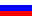

# Image list component for Angular 6+

###### Author: MrDigger <mrdigger@mail.ru>
###### © SAD-Systems [http://sad-systems.ru](), 2018

## Is used

  * [Angular 6](https://angular.io)
  * [Pug](https://pugjs.org)
  * [RxJS](http://reactivex.io/rxjs)

## Description

> 

A component represents a list of images of 9 pieces per page,
with the ability to load the next page on the "Load more" button 
(when there is no more images, the button is not displayed).
By clicking on the thumbnail image opens its full-size version.
To work with data RxJS library is used.

> 

Компонент реализующий отображение списка картинок по 9 штук на страницу, 
с возможностью догрузить следующую страницу по кнопке "Загрузить еще" 
(когда картинок больше нет, кнопка не отображается). 
По нажатию на миниатюру картинки открывается её полноразмерная версия. 
Для работы с данными используется библиотека RxJS.

### Live demo

  Try the [live demo](http://examples.sad-systems.ru/imagelist/)

### Project documentation

  All the file placed under the `/docs` folder 
  or see the [live docs](http://examples.sad-systems.ru/imagelist/docs/).
 
### Project source files

  All the file placed under the [/src](./src) folder

### Project build files

 All the file placed under the `/dist` folder.
 To see the working project replace all the files from this 
 folder to the web server document root folder. 

## To developer

### Setup
```
yarn
```

### Compiles and hot-reloads for development
```
ng serve
```

### Compiles and minifies for production
```
ng build --prod
```
